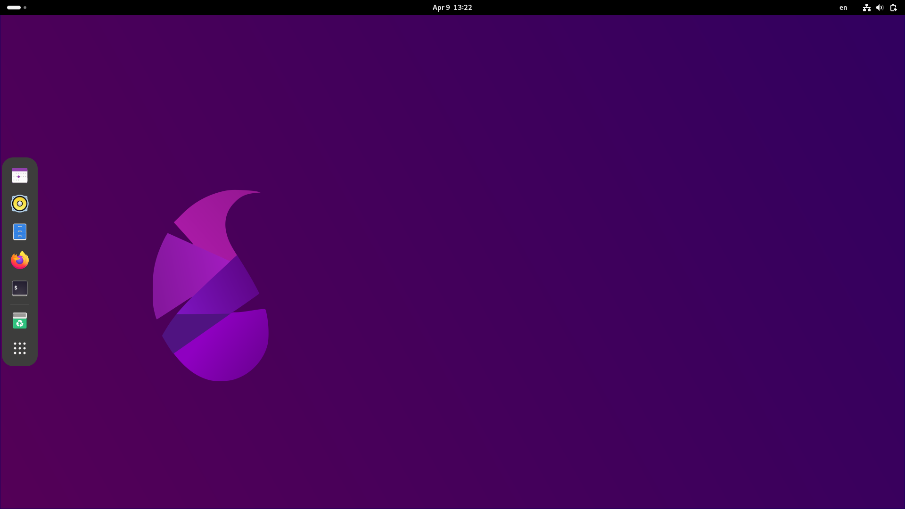

# Parch Linux Gnome edition

## EN

### What is Gnome Desktop?

GNOME is a user-friendly and modern desktop environment that provides a seamless and intuitive user experience. It is designed with simplicity, accessibility, and customization in mind. GNOME offers a wide range of features and applications, including a file manager, a web browser, a text editor, and a variety of productivity tools.

### Pre-Installed Applications

| Name         | Usage     | Category |
|--------------|-----------|------------|
| Tuba         | A client to Browse the fediverse.      | Social        |
| Fractal      | A client to Browse the [Matrix].  | Social       |
| PipeLine | A client to watch peertube and piped youtube | Movie & Music |
| Celluloid | A MPV front-end written in GTK | Movie & Music |
| G4Music | A Simple and easy to use Music Player written in vala and GTK | Movie & Music | 
| Firefox | Fast, Private & Safe Web Browser | Web Browser |
| Folio | Take notes in Markdown | Productivity |

‌
# Fa

## میزکار گنوم چیست؟

گنوم یک محیط دسکتاپ کاربرپسند و مدرن است که تجربه کاربری یکپارچه و بصری را فراهم می کند. با در نظر گرفتن سادگی، دسترسی و سفارشی سازی طراحی شده است. گنوم طیف گسترده ای از ویژگی ها و برنامه های کاربردی، از جمله مدیر فایل، مرورگر وب، ویرایشگر متن و انواع ابزارهای بهره وری را ارائه می دهد.

### برنامه های از پیش نصب شده

| نام | استفاده | دسته بندی |
|--------------|----------|------------|
| Tuba | مشتری برای مرور فدیورس. | اجتماعی |
| Fractal | مشتری برای مرور [ماتریس]. | اجتماعی |
| PipeLine | مشتری برای تماشای peertube و piped youtube | فیلم و موسیقی |
| celluloid | یک MPV front-end نوشته شده در GTK | فیلم و موسیقی |
| G4Music | یک پخش کننده موسیقی ساده و آسان برای استفاده که در vala و GTK | فیلم و موسیقی |
| FireFox | مرورگر وب سریع، خصوصی و ایمن | مرورگر وب |
| Folio | یادداشت برداری در Markdown | بهره وری |