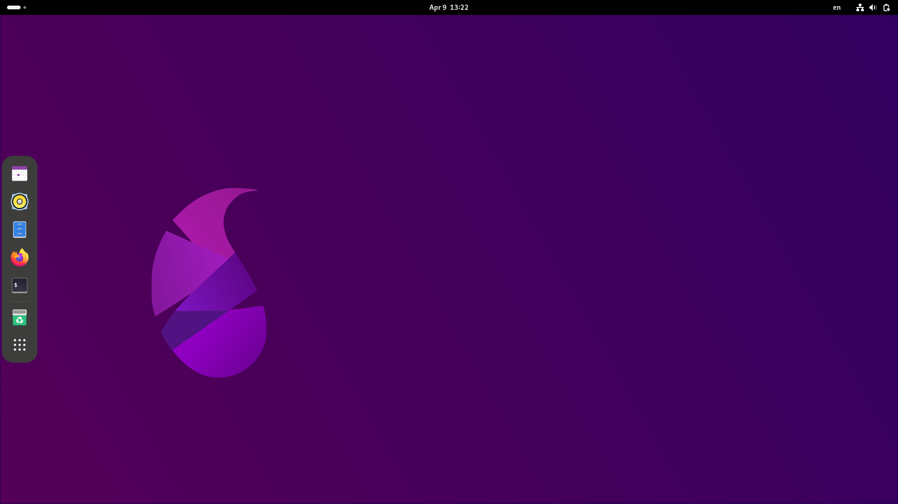

# Parch Linux Gnome edition

## EN

### What is Gnome Desktop?

GNOME is a user-friendly and modern desktop environment that provides a seamless and intuitive user experience. It is designed with simplicity, accessibility, and customization in mind. GNOME offers a wide range of features and applications, including a file manager, a web browser, a text editor, and a variety of productivity tools.

**[Pre-Installed Applications](./docs/applications-en.md)**
# Fa

## میزکار گنوم چیست؟

گنوم یک محیط دسکتاپ کاربرپسند و مدرن است که تجربه کاربری یکپارچه و بصری را فراهم می کند. با در نظر گرفتن سادگی، دسترسی و سفارشی سازی طراحی شده است. گنوم طیف گسترده ای از ویژگی ها و برنامه های کاربردی، از جمله مدیر فایل، مرورگر وب، ویرایشگر متن و انواع ابزارهای بهره وری را ارائه می دهد.

**[برنامه های از پیش نصب شده](./docs/applications-fa.md)**

